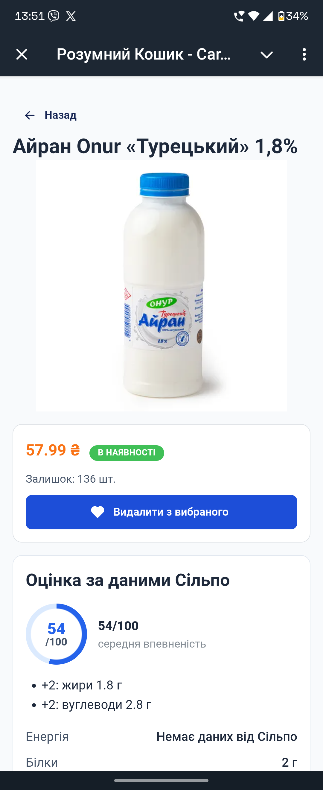
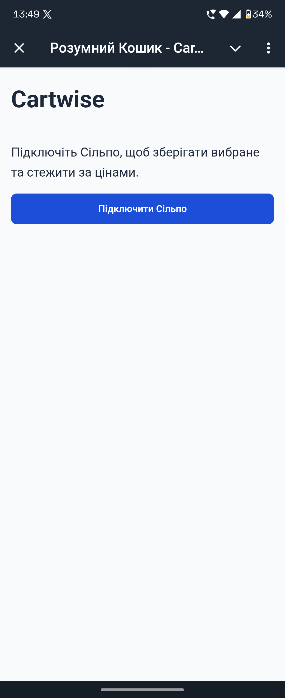
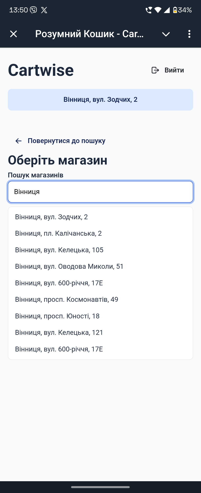
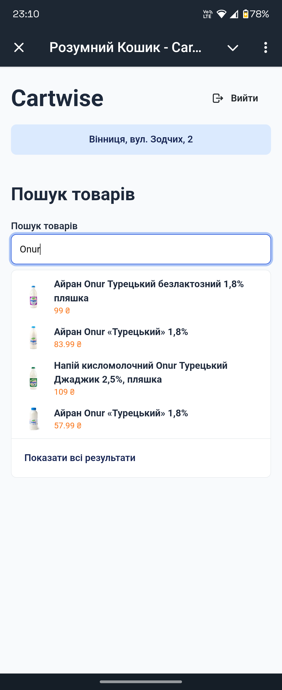
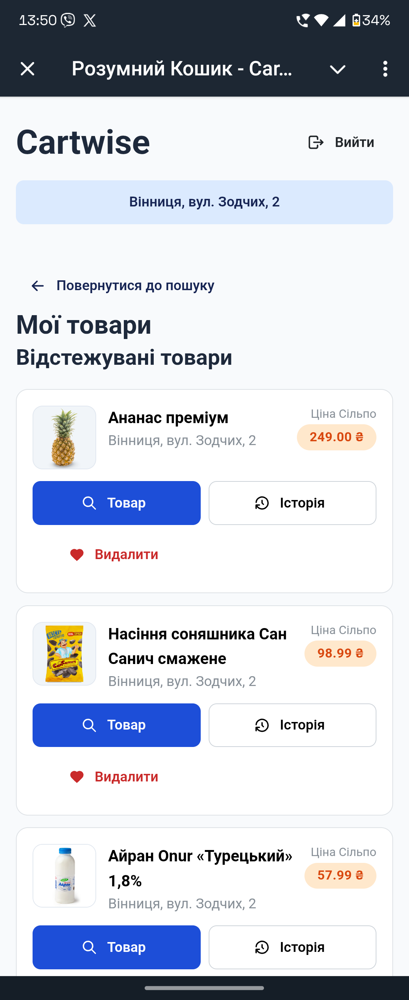
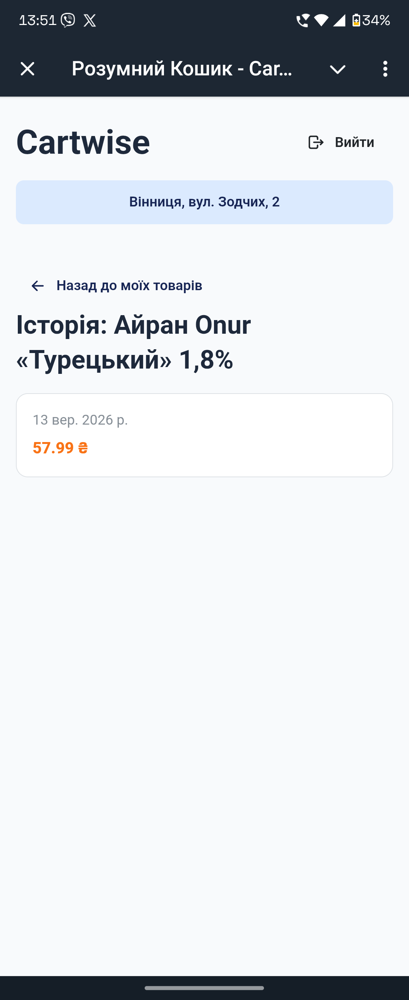
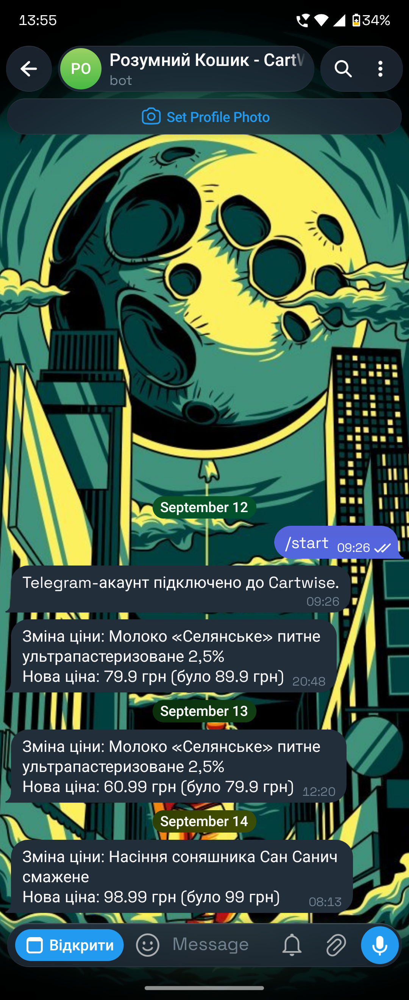

# Cartwise

> **Обирай кращий продукт. Купуй у правильний момент.**

  
  
  

Один товар — три питання: чи є він у наявності й скільки коштує, наскільки це
корисний вибір і чи є для нього «Мої пропозиції»? Cartwise дає відповідь у
одному мобільному сценарії поверх офіційного MCP «Сільпо».

  

---

## Проблема

Гість «Сільпо» обирає не абстрактний товар: важливі доступні дані про нього,
ціна у звичному магазині й момент покупки. Щоб звірити це сьогодні, доводиться
шукати товар, відкривати картку й повертатися перевіряти ціну вручну.

## Для кого

Для регулярного Гостя «Сільпо», який купує у конкретному магазині та хоче:

- зрозуміти, що відомо про товар;
- бачити його локальну ціну;
- не пропустити зміну ціни;
- переглянути «Мої пропозиції» без припущень.

## Рішення

Cartwise поєднує пошук товару, пояснювану оцінку за даними «Сільпо» та
відстеження ціни. Це не чат-асистент із загальними порадами, а послідовний
сценарій від товару до рішення про покупку.

## Agent flow: що робить Cartwise

| Крок | Гість | Cartwise |
| --- | --- | --- |
| Підключення | Підтверджує доступ до акаунта «Сільпо». | Отримує потрібний для сценарію ідентифікатор через OAuth. |
| Контекст | Обирає магазин. | Підтягує доступні магазини й зберігає контекст ціни. |
| Вибір товару | Шукає та відкриває товар. | Отримує дані через MCP і пояснює доступні сигнали в Health Score. |
| Після вибору | Додає товар у відстеження. | Фіксує зміну ціни для пари «товар + магазин» і створює подію. |

## MCP «Сільпо»: 5 tools, що дають сценарію дані

| Tool | Результат для Гостя |
| --- | --- |
| `silpo_get_my_profile` | Безпечне підключення акаунта «Сільпо». |
| `silpo_list_branches` | Вибір магазину, для якого має сенс ціна. |
| `silpo_find_products_batch` | Пошук товарів у контексті обраного магазину. |
| `silpo_get_product_details` | Дані картки товару для пояснюваного Health Score. |
| `silpo_get_my_coupons` | Перегляд «Моїх пропозицій» без вигаданої прив’язки до товару. |

## Три продуктові задачі, які ми перевірили через MCP

| Задача | Що вже працює | Чесна межа даних |
| --- | --- | --- |
| Знайти товар і відстежити ціну | Пошук за назвою у вибраному магазині, збереження товару, історія та Telegram-події про зміну ціни. | Пошук за штрихкодом був би швидшим у магазині. Це наступний крок, коли буде підтверджений контракт для barcode/EAN і сканування в застосунку. |
| Оцінити корисність товару | Пояснюваний детермінований Health Score лише за даними, які повертає «Сільпо». | Дані картки не завжди містять повний склад, тому Cartwise показує відсутність даних і рівень упевненості. |
| Автоматично підібрати «Мої пропозиції» | Cartwise показує доступні «Мої пропозиції» окремо від товару. | MCP ще не дає точного зв’язку «ця пропозиція → цей товар або кошик», тому Cartwise не вигадує найвигіднішу пропозицію. |

Саме тому MVP уже дає корисний сценарій пошуку, оцінки й відстеження ціни, а
«Мої пропозиції» показує лише в межах підтверджених даних.

---

## Demo: від пошуку до події ціни

### 1. Підключення «Сільпо»

Гість сам підтверджує підключення акаунта. Cartwise не показує токени й не
переносить їх у браузер або демо.

  

### 2. Вибір магазину

Ціна та наявність прив’язані до конкретного магазину, тому це контекст для
всіх наступних кроків.

  

### 3. Пошук товару

Результат — не порада від ШІ, а товари, знайдені через офіційний MCP у
контексті вибраного магазину.

  

### 4. «Оцінка за даними Сільпо» — Health Score

Health Score відповідає на практичне питання: який із товарів є здоровішим
вибором за доступними даними картки. Це знайомий за сценарієм Yuka орієнтир,
а не медичний діагноз.

Оцінка детерміновано пояснює доступні сигнали: енергетичну цінність,
макронутрієнти, органічність, алергени та інші наявні атрибути. Коли даних
бракує, Cartwise показує це разом із рівнем упевненості — оцінку можна
перевірити, а не лише прийняти на віру.

### 5. Відстеження ціни

Гість додає товар у відстеження. Cartwise веде історію саме для пари
**товар + магазин**, щоб ціна не губилася в загальному каталозі.

  
  

### 6. Подія в Telegram

Коли ціна відстежуваного товару змінюється, Гість отримує повідомлення і може
повернутися до конкретного товару, а не шукати його заново.

  

---

## Цінність для Гостя та бізнесу

- **Для Гостя:** менше ручних перевірок, локальна ціна й зрозуміле пояснення
  даних про товар.
- **Для бізнесу:** подія зміни ціни повертає Гостя до конкретного товару в
  момент, коли рішення про покупку може змінитися.

## Метрики

Перший тест гіпотези вимірює весь ланцюг, а не лише відкриття екрана:

- частка Гостей, які після картки додають товар у відстеження;
- частка відкриттів події зміни ціни та переходів у товар;
- час від пошуку до рішення додати товар у відстеження;
- частка Гостей, які відкривають пояснення оцінки, а не лише дивляться число.

## Додаткові можливості MVP

Повний перелік

| Можливість | Що отримує Гість |
| --- | --- |
| Підключення «Сільпо» | Безпечне підключення акаунта через OAuth. |
| Вибір і збереження магазину | Контекст для цін і товарів. |
| Пошук і картка товару | Ціна, наявність, бренд, зображення й доступні атрибути. |
| «Оцінка за даними Сільпо» (Health Score) | Пояснювана оцінка 0–100, складові й рівень упевненості. |
| Вибране та відстеження | Список товарів, історія ціни та події зміни. |
| Telegram-сповіщення | Повідомлення про зміну ціни відстежуваних товарів. |
| «Мої пропозиції» | Список активних пропозицій без непідтвердженої прив’язки до товару. |
| Повторна авторизація і вихід | Перепідключення «Сільпо» або завершення сесії. |

## Наступний крок

Щоб перетворити MVP на повний помічник вибору, Cartwise очікує три наступні
можливості MCP:

1. **Пошук за штрихкодом.** Гість сканує товар у магазині й одразу відкриває
   потрібну картку замість ручного пошуку за назвою.
2. **Повніший опис і склад товару.** Health Score точніше відрізняє солодкі
   напої та високооброблені снеки від товарів із кращим профілем; органічність
   стане одним із підтверджених позитивних сигналів, а не здогадом.
3. **Точний зв’язок «Мої пропозиції → товар або кошик».** Тоді Cartwise зможе
   автоматично підібрати справді релевантну пропозицію для вибраних товарів.

До появи цих контрактів Cartwise не вгадує: він показує лише те, що може
підтвердити.

## Матеріали

- Офіційна документація MCP: <https://ai-factory.silpo.ua/docs/mcp>
- Умови хакатону: <https://ai-factory.silpo.ua/terms>

---

> **Cartwise перетворює дані «Сільпо» на зрозуміле рішення про конкретну покупку.**
>
> [Відкрити вебверсію](https://silpo.lysak.pp.ua/) · [Відкрити Telegram Mini App](https://t.me/SiploSmartBasketBot)
